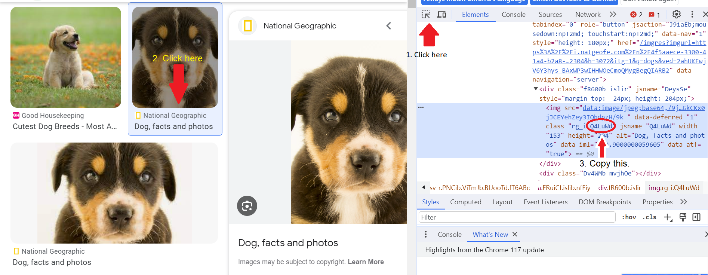
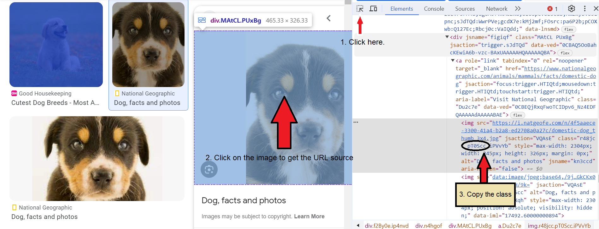

# smart-scraping-gimage
A Python script to automate the download of Google images.


# Overview

Instead of manually searching Google for images and downloading them one by one, a Python script can automate the process and download several images in a short period of time.

# Getting started

* Clone the repository
* Install the dependencies required to run the source code.

  ```Bash
  # To install the dependencies
  $ pip -r install requirements.txt
  ```

* After searching the image in Google, inspect the page by right-clicking on the thumbnail and selecting 'Inspect' or alternatively press Ctrl + Shift + I for Windows or Linux and Cmd + Option + I for macOS users.
* Select the thumbnail class as shown below.
  
  

* Select the image class after clicking on a sample image as shown below.

  

* Run the following Python code in the terminal with the URL, thumbnail class, image class, and number of images as arguments.

  ```Bash
  # To install the dependencies
  $ python main.py --url "_YOUR_URL" --thumbnail_class "_YOUR_THB_CLASS" --img_class "_YOUR_IMAGE_CLASS" --num 10
  ```
  
* The downloaded images will be stored in the newly created './imgs' folder in the same path as the current workspace.
